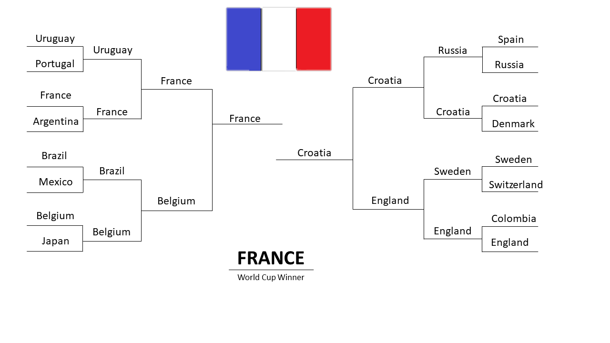

World Cup Results
=================

Every four years, the men's *World Cup* is played. This event 
is known as one of the biggest sports events in the world.
This past summer, **Russia** hosted the *2018 World Cup*. The
tournament consisted of 8 groups, each with 4 teams. Once
the round robin group play concluded, the top two teams in each
group were placed in a 16-team knockout bracket. Below is an 
image of the knockout bracket and how everything played out:

There are many takeaways from this *World Cup*. The biggest
headline-grabbing news was that the pre-tournament favorite,
**Spain**, lost the first round knockout game to host country
Russia. Spain was expected to stomp all over its opponents, 
as it did in the group stage. In addition, France lived up to,
and arguably exceeded expectations throughout the whole 
tournament in order to lift the trophy. On the opposite side
of the final, Croatia was not expected to make it past the first
couple rounds of the bracket, but ended up making it all the way
to the final. The *World Cup* Final ended 4-2 in favor of France,
as the high-scoring game was one of the most exciting finals 
to date. Can't wait for *World Cup* 2022!